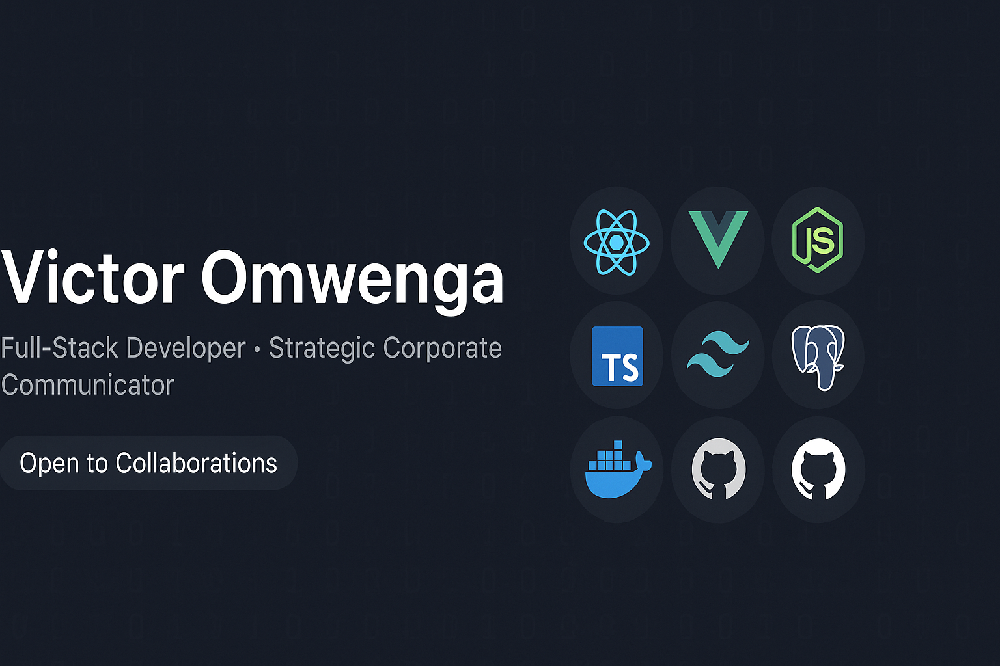

  

# 👋 Hi, I’m **Victor Omwenga** 🚀
*Frontend Developer | Full-Stack Enthusiast | Strategic Corporate Communicator | Problem Solver*  

I build **clean, user-focused web applications** while applying strategic communication skills in corporate and digital environments. Passionate about **React, Vue, Rails, Node.js**, and modern web technologies — always curious about **DevOps, testing, automation, and digital strategy**.

---

## 🌱 What I’m Working On

Click to expand

- Enhancing **full-stack skills** (React + Rails + Node.js)  
- Learning **TypeScript** and **Express** for stronger backend development  
- Building **real-world projects** that solve problems  
- Exploring **no-code tools**, app integrations, and automation  
- Improving **SEO**, corporate communication, and digital strategy  

---

## 🛠️ Tech Stack

<table>
<tr>
<td valign="top">

**Frontend:**  
  
  
  
  
  

</td>
<td valign="top">

**Backend & DB:**  
  
  
  
  

**CMS & No-Code:**  
  
  

**Tools:**  
  
  
  

</td>
</tr>
</table>

---

## 💻 Featured Tech Projects

  
  
  

---

## 📢 Strategic Communication Projects

  
  
  

---

## 📫 Let’s Connect!
  
  

---

## 📈 GitHub Stats

  
  

